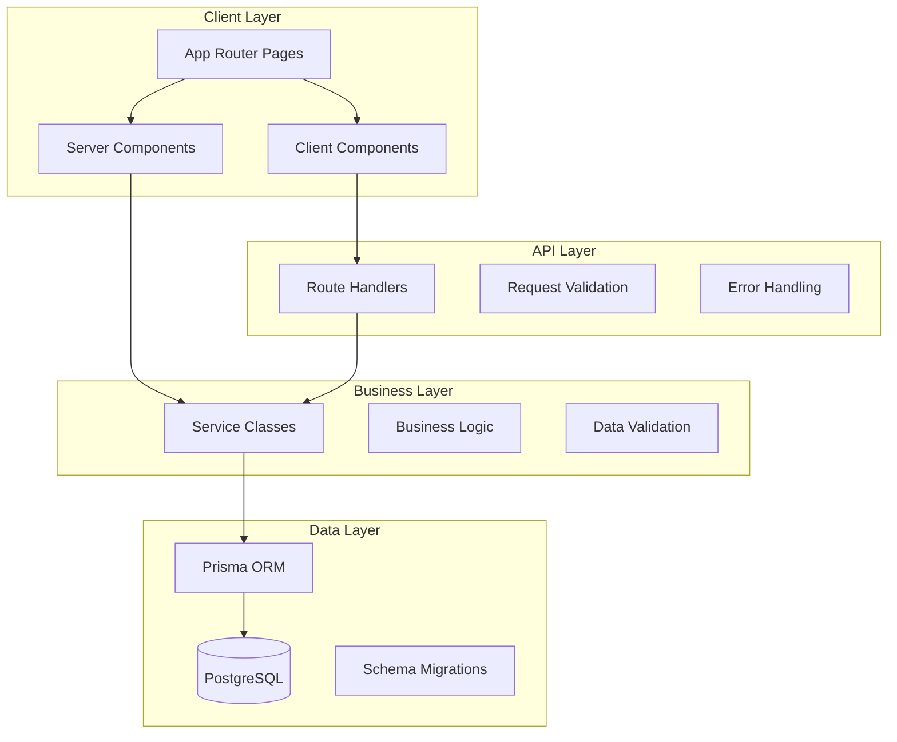

# 🏗️ Architecture Overview

This document provides a high-level overview of our Next.js application architecture, design principles, and how the different layers work together to create a scalable, maintainable system.

## 🎯 Design Principles

### 1. **API-First Architecture**

Every data operation flows through well-defined REST API endpoints, making the system reusable across web, mobile, and external integrations.

### 2. **Separation of Concerns**

Clear boundaries between presentation, business logic, and data access layers prevent tight coupling and improve maintainability.

### 3. **Type Safety**

Full TypeScript coverage from database schema to UI components ensures compile-time error detection and better developer experience.

### 4. **Performance by Default**

Optimized rendering strategies using Next.js App Router patterns for the best possible user experience.

### 5. **Testing-First**

Comprehensive testing at every layer ensures reliability and enables confident refactoring.

## 🏛️ System Architecture



## 📦 Layer Responsibilities

### **Client Layer** (`app/`, `components/`)

**Purpose**: User interface and interaction handling

**Server Components**:

- Static content rendering
- Initial data fetching
- SEO optimization
- Direct service access

**Client Components**:

- Interactive features
- Form handling
- Real-time updates
- Browser API access

**Key Files**:

- `app/page.tsx` - Homepage (Server Component)
- `app/demo/users/page.tsx` - Demo page composing components
- `components/example/user-form.tsx` - Interactive form (Client)
- `components/example/user-list.tsx` - Data display (Client)

### **API Layer** (`app/api/`)

**Purpose**: HTTP interface and request/response handling

**Responsibilities**:

- RESTful endpoint design
- Request validation
- Error standardization
- Response formatting
- HTTP status codes

**Key Files**:

- `app/api/users/route.ts` - Main users endpoints
- `app/api/users/[id]/route.ts` - Individual user operations
- `app/api/users/stats/route.ts` - Statistics endpoint

### **Business Layer** (`services/`)

**Purpose**: Core business logic and data operations

**Responsibilities**:

- Business rule enforcement
- Data validation
- Complex operations
- Error handling
- Type definitions

**Key Files**:

- `services/user.service.ts` - User operations and validation
- Service classes for other entities (future)

### **Data Layer** (`prisma/`, `lib/`)

**Purpose**: Data persistence and access

**Responsibilities**:

- Database schema definition
- Type-safe database queries
- Data migrations
- Connection management

**Key Files**:

- `prisma/schema.prisma` - Database schema
- `prisma/seed.ts` - Sample data
- `lib/prisma.ts` - Database connection

## 🔄 Data Flow Patterns

### **Server Component Flow** (Optimal for static content)

```
Server Component → Service Layer → Database
     ↓
Server-Rendered HTML
```

**Benefits**:

- No API overhead
- Better performance
- SEO-friendly
- Reduced client bundle

**Example**:

```tsx
// app/demo/server-data/page.tsx
async function UserStats() {
	const stats = await UserService.getStats() // Direct service call
	return <div>{stats.totalUsers} users</div>
}
```

### **Client Component Flow** (Optimal for interactivity)

```
Client Component → API Endpoint → Service Layer → Database
     ↓                    ↓
State Update          JSON Response
```

**Benefits**:

- Full interactivity
- Real-time updates
- Progressive enhancement
- Familiar patterns

**Example**:

```tsx
// components/example/user-form.tsx
'use client'
function UserForm() {
	const handleSubmit = async data => {
		await createUser(data) // API call
		// Update UI state
	}
}
```

## 🎨 Component Architecture

### **Component Hierarchy**

```
Page (Server Component)
├── Layout Components (Server)
├── Static Content (Server)
└── Interactive Features (Client)
    ├── Forms (Client)
    ├── Data Lists (Client)
    └── UI Components (Server/Client Compatible)
```

### **Component Types**

#### **1. Server Components** (Default)

- **When to use**: Static content, initial data, SEO-critical pages
- **File pattern**: No `'use client'` directive
- **Data access**: Direct service calls
- **Examples**: Page layouts, documentation, initial data display

#### **2. Client Components** (`'use client'`)

- **When to use**: Forms, interactions, real-time data, browser APIs
- **File pattern**: Starts with `'use client'`
- **Data access**: API calls
- **Examples**: Forms, interactive widgets, data tables

#### **3. Universal Components**

- **When to use**: Reusable UI components that work in both contexts
- **File pattern**: No hooks or browser APIs
- **Examples**: Buttons, cards, typography components

## 🛠️ Technology Decisions

### **Next.js App Router**

**Why**: Modern React patterns, better performance, easier data fetching
**Benefits**: Server components, streaming, improved SEO, better developer experience

### **TypeScript**

**Why**: Type safety, better IDE support, fewer runtime errors
**Benefits**: Compile-time error detection, better refactoring, improved documentation

### **Prisma ORM**

**Why**: Type-safe database access, excellent TypeScript integration
**Benefits**: Auto-generated types, migration system, intuitive query API

### **Tailwind CSS**

**Why**: Utility-first approach, consistent design system, small bundle size
**Benefits**: Rapid development, design consistency, excellent performance

### **Vitest + React Testing Library**

**Why**: Fast test execution, modern testing patterns, excellent Next.js support
**Benefits**: Quick feedback loops, reliable tests, good developer experience

## 📋 Architectural Patterns

### **1. Service Layer Pattern**

Centralizes business logic in dedicated service classes.

```tsx
// services/user.service.ts
export class UserService {
	static async create(data: CreateUserInput): Promise<User> {
		// Validation
		// Business logic
		// Database operation
	}
}
```

### **2. Repository Pattern** (via Prisma)

Abstracts data access through Prisma's generated client.

```tsx
// Prisma provides the repository pattern
await prisma.user.create({ data: userData })
```

### **3. API Client Pattern**

Abstracts API calls into reusable functions.

```tsx
// lib/api/users.ts
export async function createUser(data: CreateUserInput): Promise<User> {
	const response = await fetch('/api/users', {
		method: 'POST',
		body: JSON.stringify(data),
	})
	return response.json()
}
```

### **4. Composition Pattern**

Builds complex UIs by composing smaller components.

```tsx
// Server Component composing Client Components
export default function UserPage() {
	return (
		<div>
			<StaticHeader /> {/* Server Component */}
			<UserForm /> {/* Client Component */}
			<UserList /> {/* Client Component */}
		</div>
	)
}
```

## 🔐 Security Considerations

### **Input Validation**

- Server-side validation in API routes
- Type checking with TypeScript
- Sanitization of user inputs

### **Error Handling**

- Standardized error responses
- No sensitive data in client errors
- Proper HTTP status codes

### **Database Security**

- Prisma's SQL injection protection
- Environment-based connection strings
- Proper access controls

## 🚀 Scalability Features

### **Horizontal Scaling**

- Stateless server components
- API-first architecture enables microservices transition
- Database connection pooling

### **Performance Optimizations**

- Server-side rendering for initial loads
- Client-side interactions for dynamic features
- Optimized bundle splitting

### **Maintainability**

- Clear separation of concerns
- Comprehensive testing strategy
- TypeScript for reliability

## 🔧 Extension Points

### **Adding New Features**

1. **Define database schema** in `prisma/schema.prisma`
2. **Create service class** in `services/`
3. **Build API endpoints** in `app/api/`
4. **Create client functions** in `lib/api/`
5. **Build UI components** in `components/`
6. **Add tests** for all layers

### **Adding Authentication**

The architecture supports easy integration of:

- NextAuth.js for authentication
- Middleware for route protection
- User context throughout the app

### **Adding Real-time Features**

- WebSocket integration
- Server-sent events
- Real-time database subscriptions

## 📚 Related Documentation

- **[Client vs Server Components](../RENDERING_PATTERNS.md)** - Detailed rendering patterns
- **[API Design Patterns](../api/DESIGN_PATTERNS.md)** - REST API conventions
- **[Database & Service Layer](../database/SERVICE_LAYER.md)** - Data access patterns
- **[Component Development](../components/DEVELOPMENT_GUIDE.md)** - Building components
- **[Testing Strategy](../testing/STRATEGY.md)** - Testing all layers

---

This architecture provides a solid foundation for building scalable, maintainable applications while remaining flexible enough to adapt to changing requirements.
